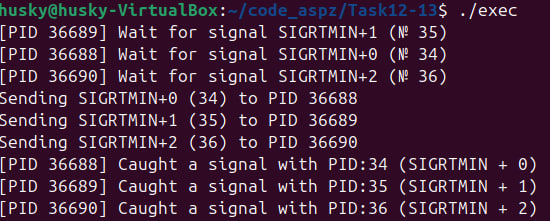

# PR12-13

### Згідно з моїм варіантом (12), моїм завданням було створити систему піблікацій-підписки, де декілька підписників будуть слухати сигнали реального часу типу SIGRTMIN - SIGRTMAX, і розташовуються серед інших сигналів, займаючи певний діапазон від SIGRTMIN до SIGRTMAX (сигнали реального часу, які мають свій діапазон і будуть надсилатися до конкретної програми (процесу) одразу на його PID за допомогою функції `kill(pid, sig)`).
### Запуск спочатку підписників, а потім публікацій я роблю за допомогою комбінації exec() + fork(), що допомагає запускати одночасно кілька програм, використовуючи лише одну)
### Також, у основному виконавчому коді реалізований запуск сигналів різної пріоритетності:
### Виконавчий код:
```
#include <stdio.h>
#include <stdlib.h>
#include <unistd.h>
#include <signal.h>
#include <sys/wait.h>

#define NUM_SUBSCRIBERS 3

int main() {
    pid_t subs[NUM_SUBSCRIBERS];
    int priorities[NUM_SUBSCRIBERS] = {0, 1, 2};

    // Fork and launch subscribers
    for (int i = 0; i < NUM_SUBSCRIBERS; ++i) {
        pid_t pid = fork();
        if (pid == 0) {
            // In child process: run ./sub with priority
            char prio_str[8];
            snprintf(prio_str, sizeof(prio_str), "%d", priorities[i]);
            execl("./sub", "./sub", prio_str, NULL);
            perror("execl (sub)");
            exit(EXIT_FAILURE);
        } else if (pid > 0) {
            subs[i] = pid; // Save PID of subscriber
        } else {
            perror("fork (subscriber)");
            exit(EXIT_FAILURE);
        }
    }

    sleep(1); // Give subscribers time to set up signal handlers

    // "Publisher" logic inside this process (not separate program)
    for (int i = 0; i < NUM_SUBSCRIBERS; ++i) {
        int sig = SIGRTMIN + priorities[i];
        printf("Sending SIGRTMIN+%d (%d) to PID %d\n", priorities[i], sig, subs[i]);
        if (kill(subs[i], sig) == -1) {
            perror("kill");
        }
    }

    // Optional: wait for subscribers if you want to let them process
    for (int i = 0; i < NUM_SUBSCRIBERS; ++i) {
        waitpid(subs[i], NULL, 0);
    }

    return 0;
}
```
### Код підписника:
```
#include <stdio.h>
#include <stdlib.h>
#include <signal.h>
#include <unistd.h>

void handle_signal(int signo, siginfo_t *info, void *context) {
    printf("[PID %d] Received SIGRTMIN+%d from PID %d\n",
           getpid(), signo - SIGRTMIN, info->si_pid);
    fflush(stdout);
}

int main(int argc, char *argv[]) {
    setvbuf(stdout, NULL, _IONBF, 0); // Disable buffering

    if (argc != 2) {
        fprintf(stderr, "Usage: %s <priority>\n", argv[0]);
        exit(EXIT_FAILURE);
    }

    int priority = atoi(argv[1]);
    int sig = SIGRTMIN + priority;

    // set signal
    struct sigaction sa;
    sa.sa_sigaction = handle_signal;
    sigemptyset(&sa.sa_mask);
    sa.sa_flags = SA_SIGINFO;

    if (sigaction(sig, &sa, NULL) == -1) {
        perror("sigaction");
        exit(EXIT_FAILURE);
    }

    printf("[PID %d] Listening on SIGRTMIN+%d (signal number %d)\n", getpid(), priority, sig);

    while (1) {
        pause();
    }

    return 0;
}
```
### Код публікації:
```
#include <stdio.h>
#include <stdlib.h>
#include <signal.h>
#include <unistd.h>

int main(int argc, char *argv[]) {
    if ((argc - 1) % 2 != 0 || argc < 3) {
        fprintf(stderr, "Usage: %s <PID1> <priority1> <PID2> <priority2> ...\n", argv[0]);
        exit(EXIT_FAILURE);
    }

    int num_targets = (argc - 1) / 2;

    for (int i = 0; i < num_targets; ++i) {
        pid_t pid = atoi(argv[i * 2 + 1]);
        int prio = atoi(argv[i * 2 + 2]);
        int sig = SIGRTMIN + prio;

        printf("Sending SIGRTMIN+%d (%d) to PID %d\n", prio, sig, pid);

        if (kill(pid, sig) == -1) {
            perror("kill");
        }
    }

    return 0;
}
```

### Результат розсилання публікацій та їх прийому:
